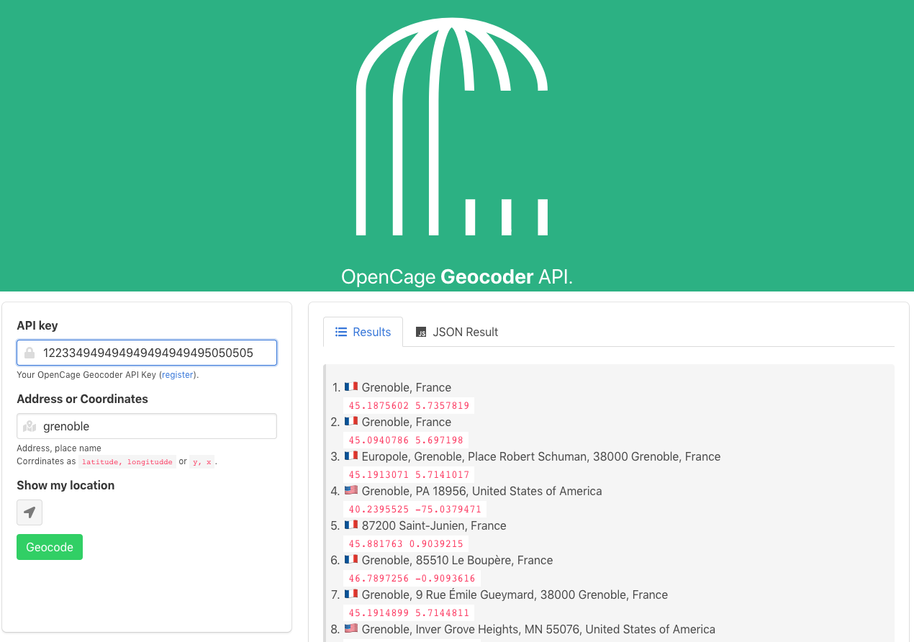

# Using Opencage Gecoder API with REACT

## Overview

In this tutorial, we will discuss about integrating [Opencage](https://opencagedata.com/) API into a [React](https://reactjs.org/) application.

The prerequisites are, of course, a OpenCage API key, (if you don't have one, simply use this free registration [link](https://opencagedata.com/users/sign_up)), a [node](https://nodejs.org/) platform with [yarn](https://yarnpkg.com/) or [npm](https://www.npmjs.com/get-npm); and finally your favorite IDE or Text Editor.

We assume you are familiar with JavaScript. In this tutorial, we're going to use some ES6 features like [`arrow functions`](https://developer.mozilla.org/en-US/docs/Web/JavaScript/Reference/Functions/Arrow_functions), [`classes`](https://developer.mozilla.org/en-US/docs/Web/JavaScript/Reference/Classes), [`let`](https://developer.mozilla.org/en-US/docs/Web/JavaScript/Reference/Statements/let), and [`const`](https://developer.mozilla.org/en-US/docs/Web/JavaScript/Reference/Statements/const) statements.

This tutorial is not about setting up a build environment for React, so for the easy use, we will use [create-react-app](https://facebook.github.io/create-react-app/).

## Setup the environment

As current node version, when writing this guide, is 10.12; I assume you can use `npx` as it is available since version 5.2.

```bash
$ npx create-react-app opencage-react-app
```

it outputs :

```bash
Creating a new React app in [...]/opencage-react-app.

Installing packages. This might take a couple of minutes.
Installing react, react-dom, and react-scripts...

yarn add v1.10.1
[1/4] 🔍  Resolving packages...
[2/4] 🚚  Fetching packages...
[3/4] 🔗  Linking dependencies...
[4/4] 📃  Building fresh packages...
success Saved lockfile.
success Saved 11 new dependencies.
info Direct dependencies
├─ react-dom@16.5.2
├─ react-scripts@2.0.5
└─ react@16.5.2
info All dependencies
├─ babel-plugin-dynamic-import-node@2.2.0
├─ babel-preset-react-app@5.0.4
├─ confusing-browser-globals@1.0.4
├─ eslint-config-react-app@3.0.4
├─ eslint-plugin-jsx-a11y@6.1.2
├─ object.assign@4.1.0
├─ react-dev-utils@6.0.5
├─ react-dom@16.5.2
├─ react-error-overlay@5.0.5
├─ react-scripts@2.0.5
└─ react@16.5.2
✨  Done in 79.89s.

Initialized a git repository.

Success! Created opencage-react-app at /Users/tsamaya/work/github/tsamaya/opencage-react-app
Inside that directory, you can run several commands:

  yarn start
    Starts the development server.

  yarn build
    Bundles the app into static files for production.

  yarn test
    Starts the test runner.

  yarn eject
    Removes this tool and copies build dependencies, configuration files
    and scripts into the app directory. If you do this, you can’t go back!

We suggest that you begin by typing:

  cd opencage-react-app
  yarn start

Happy hacking!
```

## Start hacking

### First part

Let's do the suggested commands

<!--  -->

```bash
$ cd opencage-react-app
$ yarn start
```

The project is built in development mode and it opens your favorite browser on http://localhost:3000.


The page will automatically reload if you make changes to the code. So let's do it.

First of all download [opencage svg logo](https://raw.githubusercontent.com/tsamaya/opencage-react-guide/master/resources/opencage-white.svg) and copy it to the `src/` folder

Open you IDE or Text Editor with the folder `opencage-react-app`.

Edit the file `./src/App.js`

replace

```js
import logo from './logo.svg';
```

with

```js
import logo from './opencage-white.svg';
```

The app is rebuilt and instead of the atomic react logo, you should now have a Open Cage logo.

use `CTRL + C` to stop the development server.

We will now add dependencies to the project.

First the style, you can pick up your favorite CSS framework (flexbox, bootstrap or material UI), for this tutorial I picked up [Bulma]() as it is javascript free, then no react wrapper is needed to keep this tutorial simple and focused only on opencage geocode API integration.

```bash
$ yarn add bulma
```

it outputs

```
yarn add v1.10.1
[1/4] 🔍  Resolving packages...
[2/4] 🚚  Fetching packages...
[3/4] 🔗  Linking dependencies...
[4/4] 📃  Building fresh packages...

success Saved lockfile.
success Saved 3 new dependencies.
info Direct dependencies
├─ bulma@0.7.2
├─ react-dom@16.5.2
└─ react@16.5.2
info All dependencies
├─ bulma@0.7.2
├─ react-dom@16.5.2
└─ react@16.5.2
✨  Done in 8.61s.
```

let's create an Header component: duplicate `App.js` as `Header.js`

Rename `App.css` into `Header.css`. Then edit `Header.css`, we will avoid being see sick with the infinite loop animation and place the center text in the header only. The header will be a header not whole view port page.

```css
/* ./src/Header.css */
.App {
}

.App-logo {
  animation: App-logo-spin 10s linear;
  height: 40vmin;
}

.App-header {
  text-align: center;
  background-color: #20b282;
  min-height: 20vh;
  display: flex;
  flex-direction: column;
  align-items: center;
  justify-content: center;
  font-size: calc(10px + 2vmin);
  color: white;
}

.App-link {
  color: #61dafb;
}

@keyframes App-logo-spin {
  from {
    transform: rotate(0deg);
  }
  to {
    transform: rotate(360deg);
  }
}
```

Edit `./src/Header.js`:

```js
// ./src/Header.js
import React, { Component } from 'react';
import logo from './opencage-white.svg';
import './Header.css';

class Header extends Component {
  render() {
    return (
      <header className="App-header">
        
        <p>
          OpenCage <b>Geocoder</b> API.
        </p>
      </header>
    );
  }
}

export default Header;
```

Edit `./src/index.js`, adding

```js
import 'bulma/css/bulma.css';
```

after

```js
import './index.css';
```

now edit `App.js`, we first use the `Header` Component and then we prepare 2 columns.

```js
import React, { Component } from 'react';

import Header from './Header';

class App extends Component {
  render() {
    return (
      <div>
        <Header />

        <div className="columns">
          <div className="column">1</div>
          <div className="column">2</div>
        </div>
      </div>
    );
  }
}

export default App;
```

Now add packages dependencies like the opencage API client, LeafletJS, and classnames:

```bash
$ yarn add opencage-api-client leaflet classnames
```

- [opencage-api-client](https://github.com/tsamaya/opencage-api-client) is the client API for Opencage Geocoder API
- [LeafletJS](https://leafletjs.com/) is the well-known web mapping API
- [classnames](https://github.com/JedWatson/classnames) is a javascript utility lib to help build className attributes

We can start the dev server with `$ yarn start`

For now the app looks like this


In the first column we will set up the form with the search input parameters. In the second column, we will have the results as multiple tabs, starting with the readable results (formatted address and coordinates), and a second tab with the raw JSON result from the API. As you can see in the following design we will create two main components and `GeocodingForm` and `GeocodingResults`


create a file `./src/GeocodingForm.js`

```js
import React, { Component } from 'react';

class GeocodingForm extends Component {
  constructor(props) {
    super(props);
    this.state = {
      isLocating: false,
    };
    this.handleGeoLocation = this.handleGeoLocation.bind(this);
    this.handleInputChange = this.handleInputChange.bind(this);
    this.handleSubmit = props.onSubmit;
  }

  handleGeoLocation() {
    const geolocation = navigator.geolocation;
    const p = new Promise((resolve, reject) => {
      if (!geolocation) {
        reject(new Error('Not Supported'));
      }
      this.setState({
        isLocating: true,
      });

      geolocation.getCurrentPosition(
        position => {
          console.log('Location found');
          resolve(position);
        },
        () => {
          console.log('Location : Permission denied');
          reject(new Error('Permission denied'));
        }
      );
    });
    p.then(location => {
      this.setState({
        isLocating: false,
      });
      this.props.onChange(
        'query',
        location.coords.latitude + ', ' + location.coords.longitude
      );
    });
  }

  handleInputChange(event) {
    const { target } = event;
    const { name } = target;
    const value = target.type === 'checkbox' ? target.checked : target.value;
    // console.log(name, value);
    // this.setState({
    //   [name]: value,
    // });
    this.props.onChange(name, value);
  }

  handleSubmit(event) {
    console.log('Form was submitted with state: ', this.state);
    event.preventDefault();
  }

  render() {
    const { apikey, isSubmitting, query } = this.props;
    const { isLocating } = this.state;
    return (
      <div className="box form">
        <form
          onSubmit={e => {
            e.preventDefault();
          }}
        >
          {/* <!-- API KEY --> */}
          <div className="field">
            <label className="label">API key</label>
            <div className="control has-icons-left">
              <span className="icon is-small is-left">
                <i className="fas fa-lock" />
              </span>
              <input
                name="apikey"
                className="input"
                type="text"
                placeholder="YOUR-API-KEY"
                value={apikey}
                onChange={this.handleInputChange}
              />
            </div>
            <div className="help">
              Your OpenCage Geocoder API Key (
              <a href="https://opencagedata.com/users/sign_up">register</a>
              ).
            </div>
          </div>
          {/* <!-- ./API KEY --> */}
          {/* <!-- Query --> */}
          <div className="field">
            <label className="label">Address or Coordinates</label>
            <div className="control has-icons-left">
              <span className="icon is-small is-left">
                <i className="fas fa-map-marked-alt" />
              </span>
              <input
                name="query"
                className="input"
                type="text"
                placeholder="location"
                value={query}
                onChange={this.handleInputChange}
              />
              <div className="help">
                Address, place name
                <br />
                Coordinates as <code>latitude, longitude</code> or{' '}
                <code>y, x</code>.
              </div>
            </div>
          </div>
          {/* <!-- ./Query --> */}

          <div className="field">
            <label className="label">Show my location</label>
            <div className="control" onClick={this.handleGeoLocation}>
              {!isLocating && (
                <button className="button is-static">
                  <span className="icon is-small">
                    <i className="fas fa-location-arrow" />
                  </span>
                </button>
              )}
              {isLocating && (
                <button className="button is-static">
                  <span className="icon is-small">
                    <i className="fas fa-spinner fa-pulse" />
                  </span>
                </button>
              )}
            </div>
          </div>

          {/* <!-- Button Geocode --> */}
          <button
            className="button is-success"
            onClick={this.handleSubmit}
            disabled={isLocating || isSubmitting}
          >
            Geocode
          </button>
          {/* <!-- ./Button Geocode --> */}
        </form>
      </div>
    );
  }
}

export default GeocodingForm;
```

then create a file `./src/GeocodingResults.js`

```js
import React, { Component } from 'react';
import classnames from 'classnames';

import ResultList from './ResultList';
import ResultJSON from './ResultJSON';

const RESULT_TAB = 'RESULT_TAB';
const JSON_TAB = 'JSON_TAB';

class GeocodingResults extends Component {
  constructor(props) {
    super(props);
    this.state = {
      activeTab: RESULT_TAB,
    };
  }

  renderTab(title, tab, icon, activeTab) {
    return (
      <li className={classnames({ 'is-active': activeTab === tab })}>
        <a
          href="/"
          onClick={e => {
            e.preventDefault();
            this.setState({
              activeTab: tab,
            });
          }}
        >
          <span className="icon is-small">
            <i className={icon} aria-hidden="true" />
          </span>
          <span>{title}</span>
        </a>
      </li>
    );
  }

  render() {
    const { activeTab } = this.state;
    const results = this.props.response.results || [];

    return (
      <div className="box results">
        <div className="tabs is-boxed vh">
          <ul>
            {this.renderTab('Results', RESULT_TAB, 'fas fa-list-ul', activeTab)}
            {results.length > 0 &&
              this.renderTab('JSON Result', JSON_TAB, 'fab fa-js', activeTab)}
          </ul>
        </div>

        {/* List of results */}
        {activeTab === RESULT_TAB &&
          results.length > 0 && <ResultList response={this.props.response} />}
        {/* JSON result */}
        {activeTab === JSON_TAB &&
          results.length > 0 && <ResultJSON response={this.props.response} />}
      </div>
    );
  }
}

export default GeocodingResults;
```

We need to create files `./src/ResultList.js` and `./src/ResultJSON.js`

```
// ./src/ResultList.js
import React, { Component } from 'react';

class ResultList extends Component {
  render() {
    const rate = this.props.response.rate || {};
    const results = this.props.response.results || [];

    return (
      <article className="message">
        <div className="message-body">
          <ol>
            {results.map((result, index) => {
              return (
                <li key={index}>
                  {result.annotations.flag} {result.formatted}
                  <br />
                  <code>
                    {result.geometry.lat} {result.geometry.lng}
                  </code>
                </li>
              );
            })}
          </ol>
        </div>
      </article>
    );
  }
}

export default ResultList;
```

```js
// ./src/ResultJSON.js
import React, { Component } from 'react';

import './ResultJSON.css';

class ResultJSON extends Component {
  render() {
    return (
      <article className="message">
        <div className="message-body">
          <pre>{JSON.stringify(this.props.response, null, 2)}</pre>
        </div>
      </article>
    );
  }
}

export default ResultJSON;
```

To finish the first part wire the application with those two main components (GeocodingForm and GeocodingResults)

Edit the `./src/App.js` file, first the imports:

```js
import React, { Component } from 'react';

import Header from './Header';
import GeocodingForm from './GeocodingForm';
import GeocodingResults from './GeocodingResults';

import * as opencage from 'opencage-api-client';
```

now add a constructor

```js
constructor(props) {
  super(props);
  this.state = {
    query: '',
    apikey: '',
    isSubmitting: false,
    response: {},
  };

  this.handleSubmit = this.handleSubmit.bind(this);
  this.handleChange = this.handleChange.bind(this);
}
```

the App handles input text changes and the submit.

So first add the `handleChange` method

```js
handleChange(key, value) {
  this.setState({ [key]: value });
}
```

Followed by the `handleSubmit` method

```js
handleSubmit(event) {
  event.preventDefault();
  this.setState({ isSubmitting: true });
  opencage
    .geocode({ key: this.state.apikey, q: this.state.query })
    .then(response => {
      console.log(response);
      this.setState({ response, isSubmitting: false });
    })
    .catch(err => {
      console.error(err);
      this.setState({ response: {}, isSubmitting: false });
    });
}
```

Last touch for this first part, we add the main components in the `render` method:

```js
render() {
  return (
    <div>
      <Header />

      <div className="columns">
        <div className="column is-one-third-desktop">
          <GeocodingForm
            apikey={this.state.apikey}
            query={this.state.query}
            isSubmitting={this.state.isSubmitting}
            onSubmit={this.handleSubmit}
            onChange={this.handleChange}
          />
        </div>
        <div className="column">
          <GeocodingResults response={this.state.response} />
        </div>
      </div>
    </div>
  );
}
```

Here is what the app now looks like



### Second part

In this part we will add a map tab

to be continued

# Resources

# Licensing

Licensed under the MIT License

A copy of the license is available in the repository's [LICENSE](LICENSE) file.
